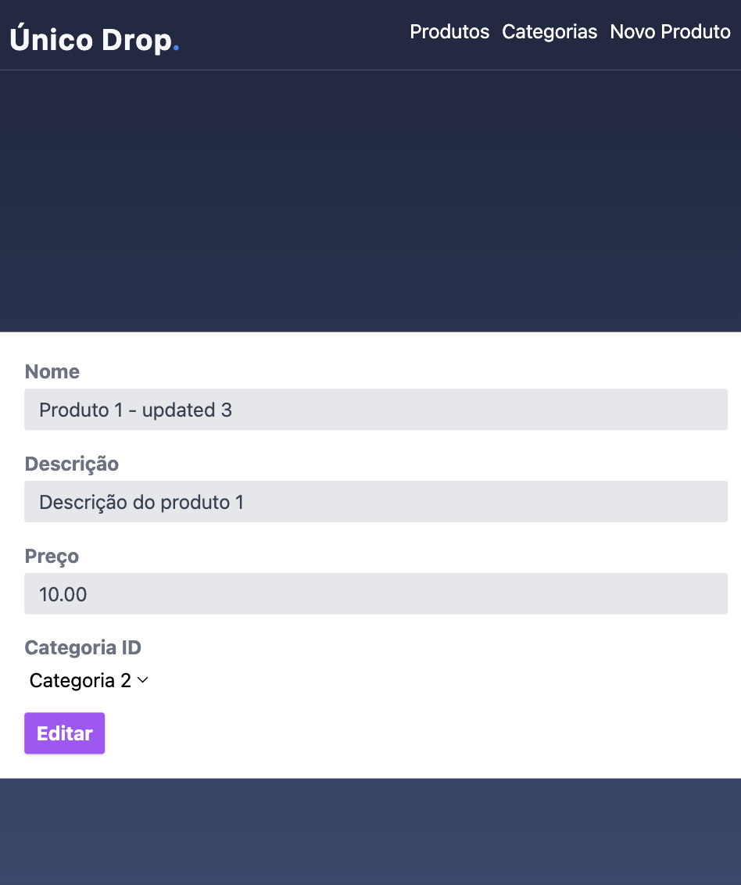
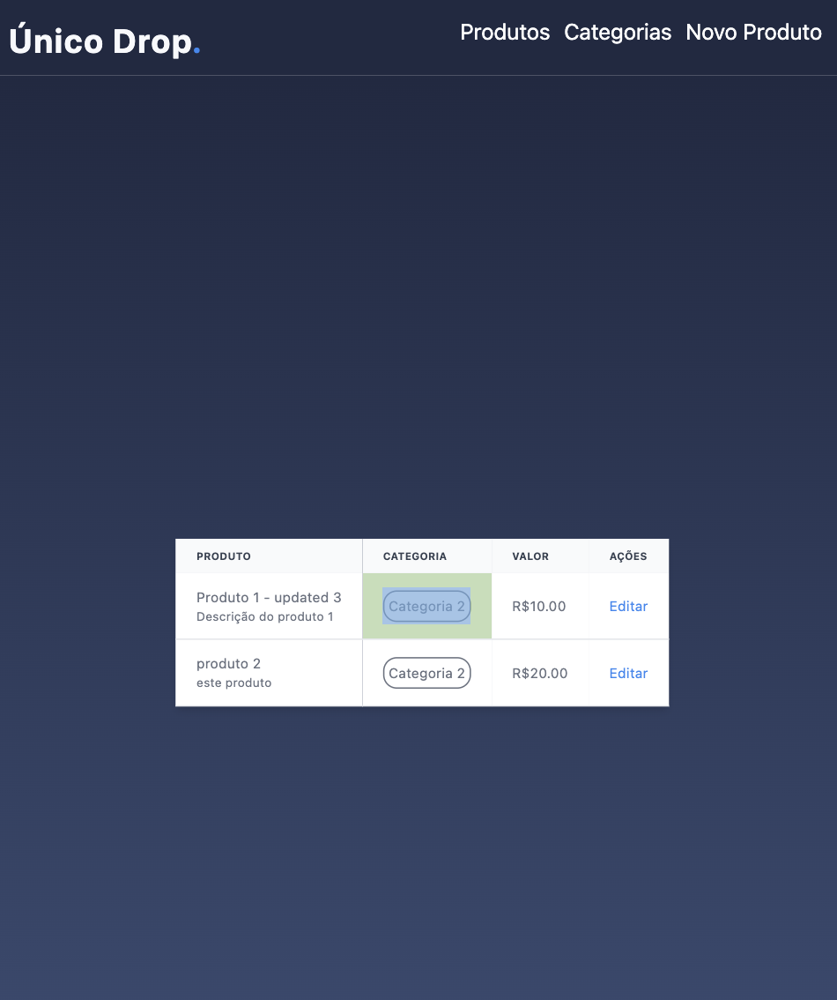

# Laravel Vue 3 CRUD de Produtos

## Descrição

Este projeto é um exemplo simples de um aplicativo web que demonstra a integração entre o framework Laravel, no lado do servidor, e o framework Vue.js 3, no lado do cliente, para realizar operações CRUD (Create, Read, Update, Delete) em uma lista de produtos.

## Funcionalidades

- **Listagem de Produtos:** Visualize uma lista de produtos cadastrados.
- **Cadastro de Produtos:** Adicione novos produtos à base de dados.
- **Edição de Produtos:** Atualize as informações de produtos existentes.
- **Exclusão de Produtos:** Remova produtos da base de dados.

## Tecnologias Utilizadas

- **Laravel:** Um framework PHP poderoso e elegante para o desenvolvimento de aplicativos web.
- **Vue.js 3:** Uma biblioteca JavaScript progressiva para construir interfaces de usuário interativas.
- **MySQL (ou outro banco de dados de sua escolha):** Armazenamento persistente para os dados dos produtos.

## Instalação e Execução

1. Clone o repositório: `git clone https://github.com/pejotadev/backoffice_products`
2. Va para a pasta api e Instale as dependências do Laravel: `composer install`
3. Copie o arquivo de ambiente: `cp .env.example .env`
4. Configure o arquivo `.env` com as informações do seu banco de dados. e crie o banco dropunico
5. Gere a chave de aplicativo do Laravel: `php artisan key:generate`
6. Execute as migrações do banco de dados: `php artisan migrate`
7. Inicie o servidor: `php artisan serve`
8. Va para a pasta vue create vue-api-frontend e Instale as dependências do Vue.js: `npm install`
9. Compile os ativos do Vue.js: `npm run serve`

Acesse a aplicação em `http://localhost:8000` e comece a explorar o CRUD de produtos!

## Imagens

## Contribuição

Contribuições são bem-vindas! Sinta-se à vontade para abrir problemas (issues) ou enviar pull requests para melhorar este projeto.

## Futuras features API

1. Autenticaçāo de usuario
2. Transformar estrutura MVC para feature by package
3. Criar DTOs para validaçāo e tranformacao dos dados
4. Configurar charset do projeto
5. Criar ErrorHandler para tratar menssagens de erro e retornar Erros em JSON
6. Criar campo categoria_id dentro de categoria para podermos criarmos N subcategorias
7.

## Futuras features Front

1. lidar com erros
2. criar estrutura melhor para buscar dados em vez de utilizar diretamente axios
3. criar telas para gestao de usuario
4. Criar views
5. criar event bus para editar e visualizar produtos na mesma view
6. deletar produtos
